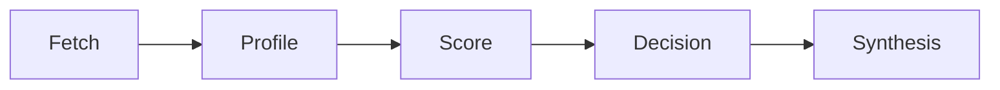

# Domain Model L1 — Humanizer Skill Review

L1 prose glossary of domain terms, organized by bounded context. Readable by reviewers and non-technical stakeholders.

## Bounded context: Candidate Evaluation

The core context. Compares humanizer skills against a rubric to inform selection or construction of a personal skill.

### Terms

- **Humanizer skill** — an agent skill (SKILL.md) that rewrites prose to remove patterns associated with AI-generated writing ("AI slop"). Synonyms: de-slop skill, anti-AI-writing skill. Avoid calling them "detectors" — most do more than detect.
- **Candidate** — a specific humanizer skill repo under review. Identified by `<owner>-<repo>` short name.
- **Profile** — a per-candidate summary document capturing SHA reviewed, feature inventory, modes, voice handling, detection approach, ethics stance, and notable design choices.
- **Rubric** — the scoring criteria against which candidates are evaluated.
- **Score** — a per-criterion rating recorded in the comparison matrix.
- **Comparison matrix** — a living table holding one row per candidate and one column per rubric criterion.
- **Decision (ADR)** — an immutable record of whether a candidate is kept, rejected, or merged into the personal skill, citing the profile and matrix.
- **Recommendation** — the final synthesis document produced once enough candidates are scored.

### Aggregates

- **Candidate** — the unit of evaluation. Has a profile, a matrix row, and zero or more ADRs. Lifecycle: fetched → profiled → scored → decided.
- **Review** — the overall effort. Owns the rubric, the matrix, and the recommendation. Singleton.

### Business rules

- A candidate cannot be scored before it is profiled.
- A candidate cannot appear in a decision before it is scored.
- The recommendation cannot be written until enough candidates have decisions (threshold TBD by reviewer).
- Candidate source is never committed to this repo; only referenced by SHA.

## Bounded context: Pattern Vocabulary

The shared language of "AI writing patterns" that all candidates detect and rewrite. Not owned by this repo — it is borrowed from the candidates and from external sources (Wikipedia "Signs of AI writing", WikiProject AI Cleanup, Copyleaks stylometric research).

### Terms

- **AI writing pattern** — a recurring feature of prose that signals machine generation. Examples: filler phrases ("it's important to note"), formulaic structures (binary contrasts, tricolons), trope vocabulary ("delve", "quietly", "serves as"), false vulnerability, invented concept labels.
- **Voice calibration** — adapting rewrite output to match a user-provided writing sample rather than a default voice.
- **Voice profile** — a named style target (casual, professional, technical, warm, blunt, sharp-opinionated).
- **Detection mode** — a mode that flags AI patterns without rewriting. Distinct from rewrite mode.
- **Edit mode** — a mode that applies in-place file edits using the Edit tool. Distinct from rewrite mode which returns text inline.
- **Convergence pass** — iterating rewrites until no further AI patterns are detected.
- **Signals, not proof** — the ethics stance that AI-pattern detection is probabilistic and should not be treated as ground truth. Particularly relevant for non-native English writers (see Stanford Liang et al., BFI 2025-116).

### Avoid

- Avoid "detector" as a synonym for "humanizer skill" — most candidates do more than detect.
- Avoid "AI content" as a synonym for "AI writing patterns" — the patterns are stylometric, not content-based.

## Bounded context: Review Process

The workflow that drives evaluation forward.

### Terms

- **Fetch** — clone a candidate repo into `skills/<short-name>/` (raw, gitignored), then mirror into the trove at `docs/troves/humanizer-skills/sources/<short-name>/`.
- **Profile step** — write the per-candidate profile using the template.
- **Score step** — rate the candidate against each rubric criterion and record in the matrix.
- **Decision step** — write an ADR (keep/reject/merge) citing the profile and matrix.
- **Synthesis step** — write the recommendation once enough candidates have decisions.

The process is not strictly linear — profiles may be revisited as candidates release new versions (note the SHA reviewed), and the matrix may be reordered as criteria evolve. ADRs, once adopted, are immutable: supersede, don't edit.