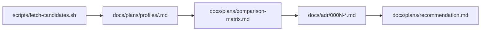

# Project Navigation

## Starting points

- `PURPOSE.md` — one-paragraph outcome
- `README.md` — user-facing landing page
- `AGENTS.md` — this file, plus `docs/agents-detail/` for agent-specific guidance

## Hubs and spokes

The `docs/` tree splits into two architectural surfaces plus cross-cutting hubs:

Technical architecture (how the system is built and deployed):
- `docs/ARCHITECTURE.md` → `docs/technical-architecture/`
- `docs/technical-architecture/c4/{context,container,component,deployment}.md`
- `docs/technical-architecture/tech-stack.md`

Domain architecture (what the system means to its domain experts):
- `docs/DOMAIN-MODEL-L1.md` — L1 prose glossary (at the surface, no hub above it)
- `docs/domain-architecture/CONTEXT-MAP.md` — bounded context relationships
- `docs/domain-architecture/DOMAIN-EVENTS.md` — cross-context integration events
- `docs/domain-architecture/DOMAIN-MODEL-L2.md` — L2 ubiquitous language (ERDs, invariants)
- `docs/domain-architecture/events/` — event contract YAML specs

Cross-cutting:
- `docs/DEVELOPER-WORKFLOWS.md` → `docs/developer-workflows/`
- `docs/USER-EXPERIENCE.md` → `docs/user-experience/`
- `AGENTS.md` → `docs/agents-detail/`
- `docs/adr/` — numbered decision records (no hub file)
- `docs/plans/` — implementation plans and specs (no hub file)
  - `docs/plans/profiles/` — per-candidate profiles
  - `docs/plans/rubric.md` — scoring criteria
  - `docs/plans/comparison-matrix.md` — living scoring table
  - `docs/plans/recommendation.md` — final synthesis
- `docs/musings/` — pre-artifact thought capture (no hub file)
- `docs/retros/` — post-session reflection docs from the Retro ritual (no hub file)
- `docs/tech-debt/` — pre-existing LSP errors and other tech debt (no hub file)

Read the hub first, then drill into spokes when you need detail.

## Review workflow

1. **Fetch** candidate repos into `skills/<short-name>/` (gitignored).
2. **Profile** each candidate using `docs/plans/candidate-profile-template.md`.
3. **Score** each against `docs/plans/rubric.md`, recording in `docs/plans/comparison-matrix.md`.
4. **Decide** via an ADR (keep/reject/merge) citing the profile and matrix.
5. **Synthesize** into `docs/plans/recommendation.md` once enough candidates have decisions.