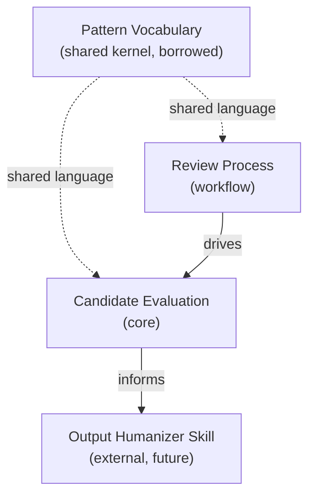

# Context Map

Bounded contexts and their relationships within the humanizer-skill-review workspace.

## Relationships

| From | To | Type | Notes |
|---|---|---|---|
| Pattern Vocabulary | Candidate Evaluation | Shared kernel | The vocabulary of AI writing patterns is borrowed from candidates and external sources; all evaluation uses it. |
| Pattern Vocabulary | Review Process | Shared kernel | The process refers to patterns by name when scoring. |
| Review Process | Candidate Evaluation | Upstream/downstream | The process drives evaluation forward through fetch → profile → score → decide → synthesize. |
| Candidate Evaluation | Output Humanizer Skill | Open host service / published language | The eventual output skill is not part of this repo. This workspace publishes a recommendation that the output skill consumes. |

## External contexts (not modeled here)

- **Candidate skill repos** — read-only git clones. Treated as external systems, not bounded contexts within this workspace.
- **External research** — Wikipedia "Signs of AI writing", WikiProject AI Cleanup, Copyleaks stylometric research, Stanford Liang et al. These inform the Pattern Vocabulary but are not owned here.