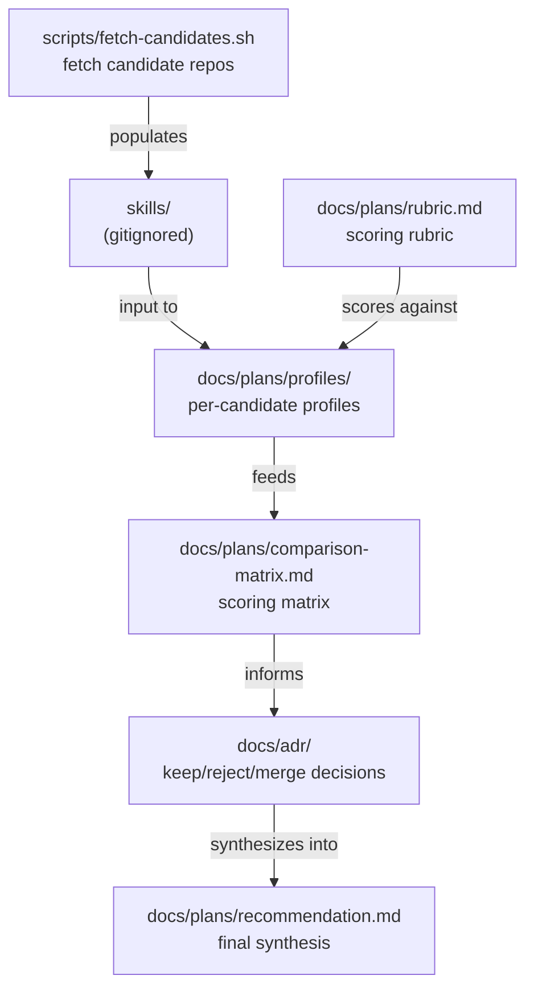

# C4 Component

Components inside the single container (the repo on disk).

## Component responsibilities

| Component | Responsibility |
|---|---|
| `scripts/fetch-candidates.sh` | Clone candidate repos into `skills/<short-name>/` |
| `docs/plans/rubric.md` | Define scoring criteria |
| `docs/plans/profiles/<name>.md` | Per-candidate summary, SHA reviewed, feature inventory |
| `docs/plans/comparison-matrix.md` | Side-by-side scoring table |
| `docs/adr/` | Immutable decisions citing profiles + matrix |
| `docs/plans/recommendation.md` | Final synthesis once enough candidates are scored |