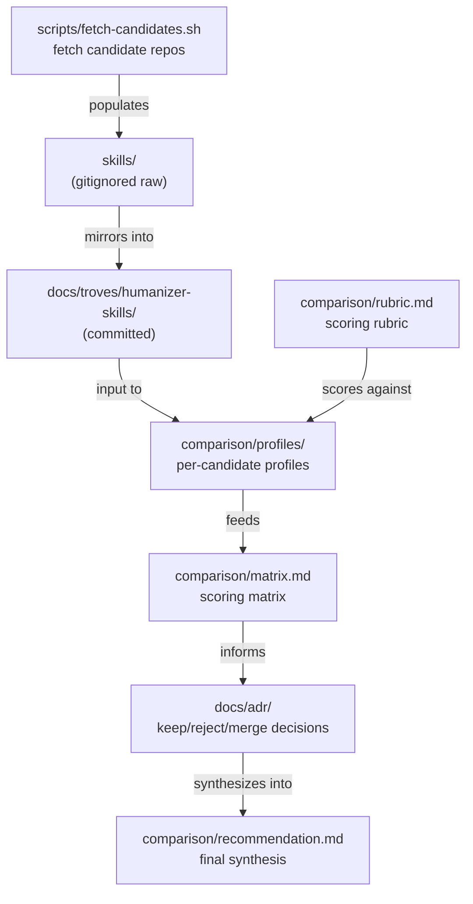

# C4 Component

Components inside the single container (the repo on disk).

## Component responsibilities

| Component | Responsibility |
|---|---|
| `scripts/fetch-candidates.sh` | Clone candidate repos into `skills/<short-name>/` (raw, gitignored) |
| `tests/harness/build-trove.py` | Mirror raw clones into committed trove at `docs/troves/humanizer-skills/` |
| `comparison/rubric.md` | Define scoring criteria |
| `comparison/profiles/<name>.md` | Per-candidate summary, SHA reviewed, feature inventory |
| `comparison/matrix.md` | Side-by-side scoring table |
| `comparison/recommendation.md` | Final synthesis once enough candidates are scored |