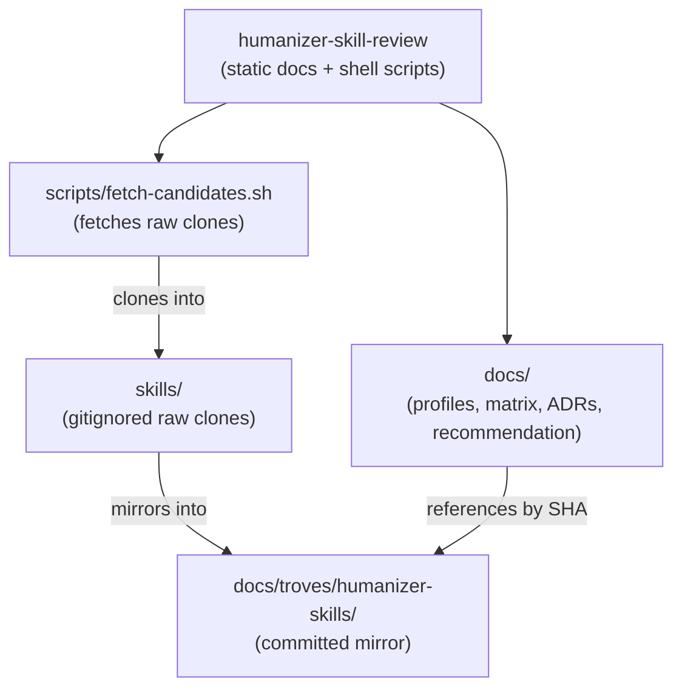

# C4 Container

Single static artifact — a collection of markdown documents and shell scripts. No server, no database, no build step.

```mermaid
flowchart TD
    Repo["humanizer-skill-review<br/>(static docs + shell scripts)"]
    Fetch["scripts/fetch-candidates.sh<br/>(fetches raw clones)"]
    Trove["docs/troves/humanizer-skills/<br/>(committed mirror)"]
    Docs["docs/<br/>(profiles, matrix, ADRs, recommendation)"]
    Skills["skills/<br/>(gitignored raw clones)"]

    Repo --> Fetch
    Repo --> Docs
    Fetch -->|"clones into"| Skills
    Skills -->|"mirrors into"| Trove
    Docs -->|"references by SHA"| Trove
```

There is exactly one container: the repo itself on disk.