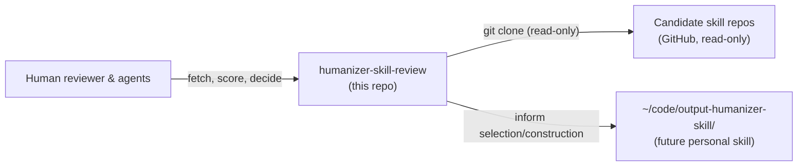

# C4 Context

## System context

## Actors

- **Human reviewer & agents** — consult the workspace to compare candidates and record decisions.

## External systems

- **Candidate skill repos** — public GitHub repos fetched into `skills/<short-name>/` (gitignored raw snapshots), then mirrored into the committed trove at `docs/troves/humanizer-skills/`.
- **`~/code/output-humanizer-skill/`** — the future personal humanizer skill that this workspace informs. Not part of this repo.